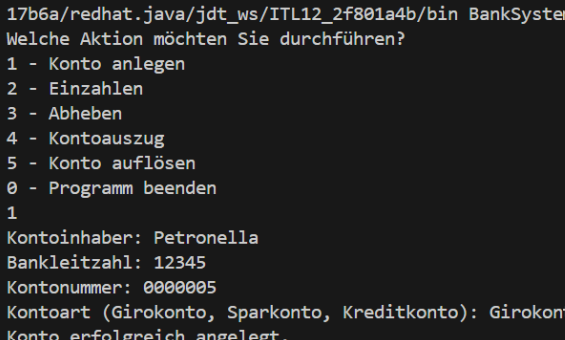

### BankSystem

Ein einfaches Java-Konsolenprogramm zur Verwaltung von Bankkonten. Benutzer können Konten erstellen, Einzahlungen und Abhebungen vornehmen, Kontoauszüge anzeigen und Konten löschen.

### Beschreibung der Software

Das Programm ermöglicht grundlegende Bankoperationen über die Konsole. Es unterstützt das Erstellen, Verwalten und Löschen von Konten sowie das Einzahlen und Abheben von Geldbeträgen.

### Installation

#### Voraussetzungen

- Java Development Kit (JDK) 8 oder höher

#### Kompilieren und Ausführen

1. Speichere die Datei als `BankSystem.java`.
2. Öffne ein Terminal oder eine Eingabeaufforderung und navigiere zum Speicherort der Datei.
3. Kompiliere den Code mit:
   ```sh
   javac BankSystem.java
   ```
4. Starte das Programm mit:
   ```sh
   java BankSystem
   ```

### Verwendete Technologien & mögliche Erweiterungen

- **Technologien**: Java, Konsolenanwendung
- **Erweiterungen**:
  - Integration mit einer Datenbank für persistente Speicherung
  - Web-Oberfläche mit REST-API für eine moderne Benutzererfahrung
  - Erweiterte Sicherheitsmechanismen wie Authentifizierung

### Screenshots



### Lizenz

Dieses Projekt steht unter der MIT-Lizenz.

